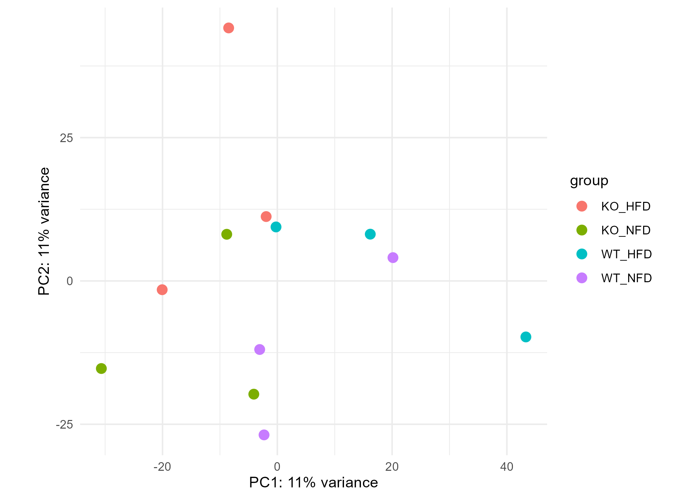
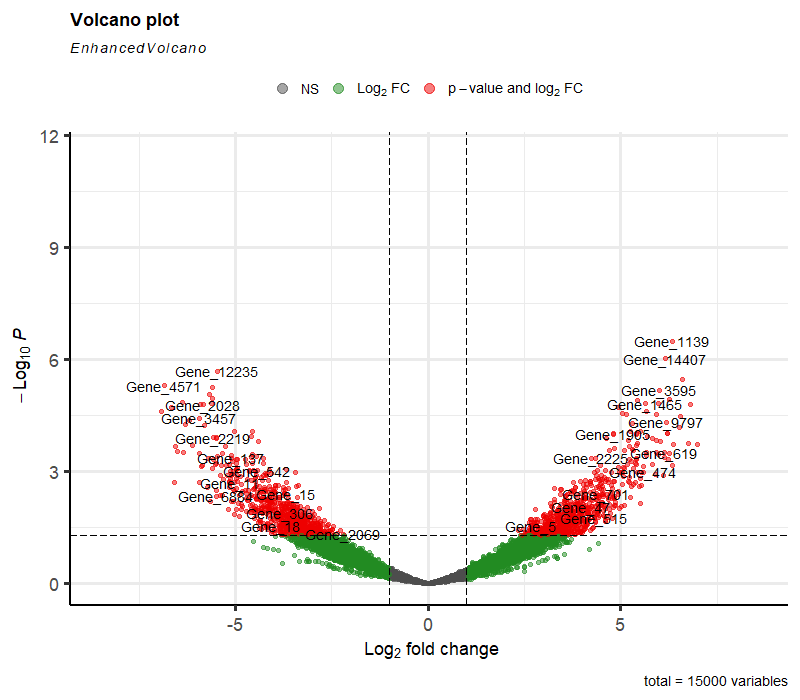
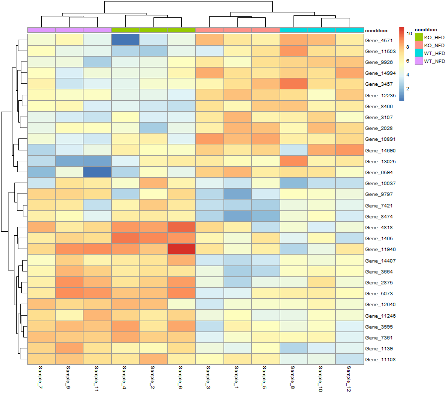

# 🧬 RNA-seq Analysis of Skeletal Muscle in Mouse Models of Metabolic Dysfunction
This repository contains a complete RNA-seq analysis pipeline developed during my undergraduate research project in Biological Sciences. The study focuses on transcriptional alterations in mouse skeletal muscle associated with metabolic dysfunction, considering both genetic and dietary factors.

---

## 🔬 Biological Background

Metabolic disorders such as diabetes are strongly associated with mitochondrial dysfunction and impaired energy homeostasis. Mitofusin 2 (MFN2) plays a key role in mitochondrial dynamics, and alterations in its expression have been linked to metabolic phenotypes.

This project investigates how **MFN2 genotype** and **maternal diet** influence gene expression profiles in skeletal muscle, using RNA sequencing as the primary analytical approach.

---

## 🧪 Experimental Design

The experimental design includes four groups defined by genotype and dietary condition:

| Genotype | Diet |
|--------|------|
| MFN2 Knockout (KO) | Normal Fat Diet (NFD) |
| MFN2 Knockout (KO) | High Fat Diet (HFD) |
| MFN2 Wild-Type (WT) | Normal Fat Diet (NFD) |
| MFN2 Wild-Type (WT) | High Fat Diet (HFD) |

This factorial design allows the evaluation of:
- Genotype effects (MFN2 KO vs WT)
- Dietary effects (NFD vs HFD)
- Genotype × diet interaction effects

---

## ⚙️ Bioinformatics Workflow

### 1️⃣ RNA-seq Pre-processing and Quantification (Linux)

All initial steps of the RNA-seq pipeline were performed in a Linux environment and included:

- Quality control of raw FASTQ files  
- Alignment to the mouse reference genome  
- Generation of sorted BAM files  
- Gene-level read quantification using `featureCounts`  

These steps resulted in a raw gene count matrix used for downstream statistical analysis.

---

### 2️⃣ Differential Expression Analysis (R / DESeq2)

Downstream analyses were performed in **R**, using the **DESeq2** package, and included:

- Import of raw gene count matrices
- Data normalization using variance stabilizing transformation (VST)
- Exploratory data analysis through Principal Component Analysis (PCA)
- Differential gene expression analysis using a multifactorial design:
  

- Identification of genes associated with genotype, diet, and interaction effects

---

## 📊 Data Visualization

The following visualizations were generated to support data interpretation:

### Principal Component Analysis (PCA)
Used to assess global transcriptomic variation and sample clustering across experimental conditions.

### Volcano Plot
Visualization of differentially expressed genes based on log2 fold-change and statistical significance.

### Heatmap of Differentially Expressed Genes
Expression patterns of the most statistically significant genes across samples.

---

## 🔐 Data Availability and Reproducibility

Due to data confidentiality and ethical considerations, the datasets provided in this repository are **simulated** to resemble the original experimental design and count distributions.

All scripts, statistical models, and analytical steps are identical to those applied in the original study, ensuring methodological reproducibility and transparency.

---

## 🛠️ Tools and Packages

- R
- DESeq2
- ggplot2
- pheatmap
- EnhancedVolcano
- Linux-based RNA-seq tools (alignment and featureCounts)

---

## 📌 Key Takeaways

This project demonstrates:
- A complete RNA-seq analysis pipeline from raw sequencing data to biological interpretation
- Integration of Linux-based preprocessing and R-based statistical analysis
- Application of multifactorial experimental design in transcriptomic studies
- Commitment to reproducibility and ethical data handling

---

## 👩‍🔬 Author

Biologist (B.Sc.) from the Federal University of São Carlos (UFSCar) with experience in bioinformatics, transcriptomics, and biostatistics.
