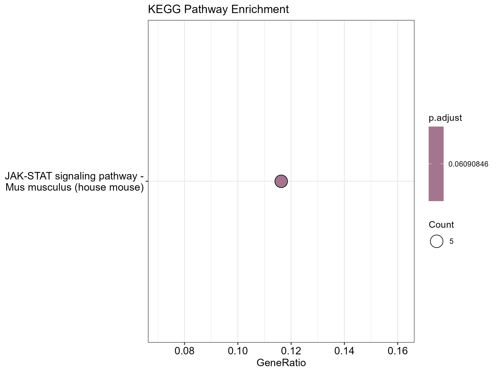
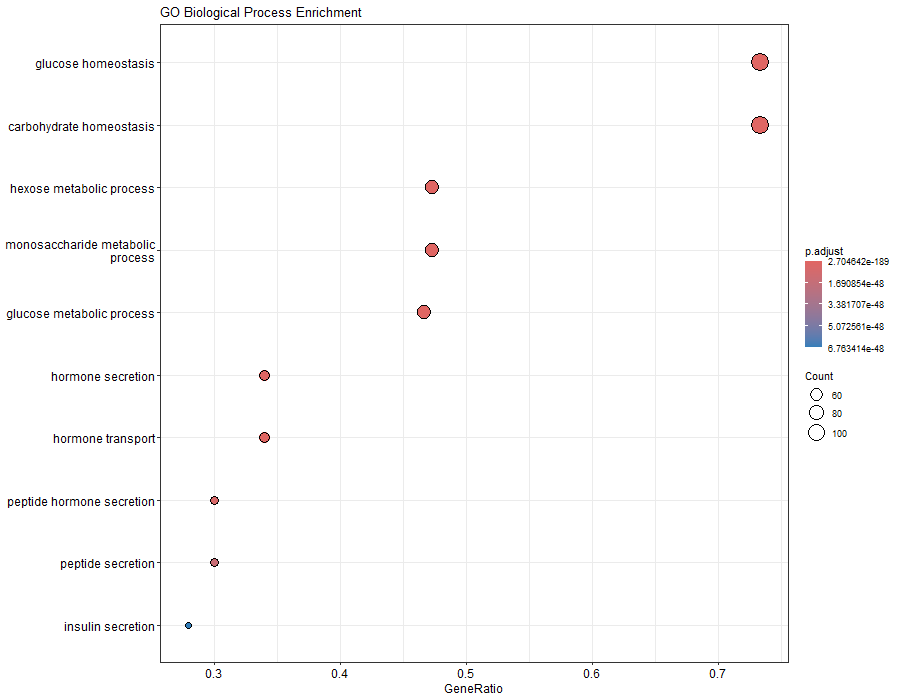
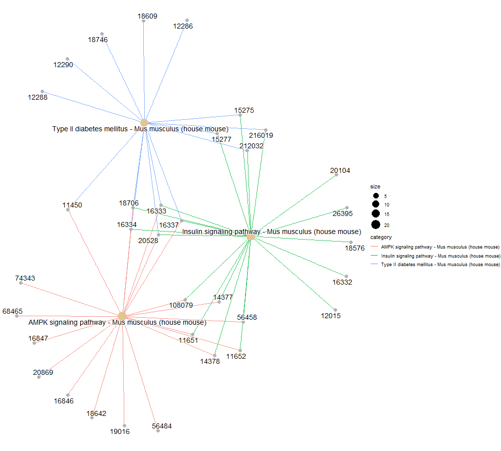

# 🧬 RNA-seq Analysis of Skeletal Muscle in Mouse Models of Metabolic Dysfunction

This repository contains a complete and reproducible RNA-seq analysis pipeline developed during my undergraduate research project in Biological Sciences. The study investigates transcriptional and functional alterations in mouse skeletal muscle associated with metabolic dysfunction, integrating genetic and dietary factors.

---

## 🔬 Biological Background

Metabolic disorders such as diabetes are closely linked to mitochondrial dysfunction, impaired insulin signaling, and altered energy homeostasis. Mitofusin 2 (MFN2) is a key regulator of mitochondrial dynamics, and disruptions in MFN2 function have been associated with metabolic phenotypes.

This project evaluates how **MFN2 genotype** and **dietary condition** influence gene expression profiles and biological pathways in skeletal muscle, using RNA sequencing combined with functional enrichment analysis.

---

## 🧪 Experimental Design

RNA-seq data were generated from mouse skeletal muscle samples organized into four experimental groups:

| Genotype | Diet |
|--------|------|
| MFN2 Knockout (KO) | Normal Fat Diet (NFD) |
| MFN2 Knockout (KO) | High Fat Diet (HFD) |
| MFN2 Wild-Type (WT) | Normal Fat Diet (NFD) |
| MFN2 Wild-Type (WT) | High Fat Diet (HFD) |

This factorial design allows the assessment of:
- Main effects of genotype (MFN2 KO vs WT)
- Main effects of diet (NFD vs HFD)
- **Genotype × diet interaction effects**

---

## ⚙️ Bioinformatics Workflow

### 1️⃣ RNA-seq Pre-processing and Quantification (Linux)

Initial processing steps were performed in a Linux environment and included:

- Quality control of raw FASTQ files  
- Alignment to the mouse reference genome  
- Sorting and indexing of BAM files  
- Gene-level read quantification using `featureCounts`  

These steps resulted in a raw gene count matrix used for downstream statistical analysis.

---

### 2️⃣ Differential Expression Analysis (R / DESeq2)

Downstream analyses were conducted in **R** using the **DESeq2** package and included:

- Import of raw gene count matrices
- Normalization using variance stabilizing transformation (VST)
- Exploratory analysis through Principal Component Analysis (PCA)
- Differential expression analysis using a multifactorial design:

This model enables the identification of genes associated with genotype effects, dietary effects, and interaction effects.

---

## 📊 Exploratory Data Analysis and Visualization

### Principal Component Analysis (PCA)
PCA was used to evaluate global transcriptomic variation and sample clustering across experimental conditions.

### Volcano Plot
Volcano plots were generated to visualize differentially expressed genes based on log2 fold-change and statistical significance.

### Heatmap of Differentially Expressed Genes
Heatmaps illustrate expression patterns of the most statistically significant genes across samples.

---

## 🧠 Functional and Pathway Enrichment Analysis

To interpret the biological relevance of transcriptional changes, functional enrichment analyses were performed using **Gene Ontology (GO)** and **KEGG** databases.

### KEGG Pathway Enrichment
Pathway analysis revealed enrichment of metabolic and signaling pathways, including those related to **insulin signaling**, energy metabolism, and mitochondrial function.

### Gene Ontology Enrichment
GO enrichment highlighted biological processes associated with glucose metabolism, energy homeostasis, and cellular stress responses.

---

### Genotype × Diet Interaction Effects

To specifically explore interaction effects between MFN2 genotype and dietary condition, enrichment analysis was performed on genes associated with metabolic processes affected by the genotype × diet interaction.

Network-based visualization revealed coordinated regulation of genes involved in glucose metabolism, insulin signaling, and mitochondrial organization.

---

## 🔐 Data Availability and Reproducibility

Due to data confidentiality and ethical considerations, the datasets provided in this repository are **simulated** to resemble the original experimental design and count distributions.

All scripts, statistical models, and analytical steps faithfully reproduce the original analysis pipeline, ensuring transparency and reproducibility while preserving data confidentiality.

---

## 🛠️ Tools and Packages

- Linux-based RNA-seq tools (alignment and featureCounts)
- R
- DESeq2
- ggplot2
- pheatmap
- EnhancedVolcano
- clusterProfiler
- org.Mm.eg.db
- enrichplot

---

## 📌 Key Takeaways

This project demonstrates:

- A complete RNA-seq workflow from raw sequencing data to biological interpretation  
- Integration of Linux-based preprocessing with R-based statistical analysis  
- Application of multifactorial experimental design in transcriptomics  
- Functional interpretation of gene expression changes through pathway enrichment  
- Biological insights into metabolic regulation and insulin-related pathways  

---

## 👩‍🔬 Author

Biologist (B.Sc.) from the Federal University of São Carlos (UFSCar) with experience in bioinformatics, transcriptomics, functional genomics, and biostatistics.
